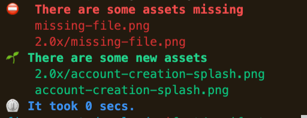

## Intro

[](https://github.com/robertohuertasm/figma-asset-downloader/actions) [](https://crates.io/crates/figma-asset-downloader)

Small utility to help you optimize & download [Figma](https://www.figma.com/) assets directly to your computer.

## Motivation

It may be very useful to keep the assets of your app/web up to date with the latest designs that your Design Team produces in [Figma](https://www.figma.com/).

Let's say your Design Team puts all the `assets` in a specific page of a [Figma](https://www.figma.com/) document. This utility would **automatically fetch all the images** from there and keep your assets folder up to date with the latest resources. Nice, isn't it?

I built this tool while working on the [Evermind](https://evermind.health/) app at [Telefónica Alpha](https://www.alpha.company/). I realized there were no tools that could make it easy to keep in sync the app assets with the [Figma](https://www.figma.com/) assets, and I was a little bit tired of the [Figma manual export system](https://help.figma.com/hc/en-us/articles/360040028114-Getting-Started-with-Exports).

The tool is **open source** and has a **MIT license** so feel free to use it, modify it or extend it in any form if you need it.

I hope it can be useful for your team, too! :wink:

You can learn more about the process of creation of this tool in this [dev.to post](https://dev.to/robertohuertasm/sync-your-figma-assets-with-your-dev-environment-13bd) I wrote.

## Installation

You can currently get artifacts for `Windows`, `MacOS` & `Ubuntu`. 

Just download your preferred release from [GitHub releases](https://github.com/robertohuertasm/figma-asset-downloader/releases), unzip it and add the `fad` executable to your path.

You can compile it yourself if you need to use it in another `OS`:

```sh
cargo install figma-asset-downloader
```

## Requirements

You'll need to get a [Figma Personal Access Token](https://www.figma.com/developers/api#access-tokens) in order to use the tool. Follow [this link](https://www.figma.com/developers/api#access-tokens) to learn how to get it.


## Usage

The usage is fairly simple:

```sh
fad -t <personal-access-token> -f <file-id> -d <document-id>
```

To get the `file-id` and the `document-id`, you have to take a look at the `url` of the Figma page that you want to download the images from.

You should be seeing something similar to this:

`https://www.figma.com/file/FILE_ID/file_title?node-id=DOCUMENT_ID`

Just get that pieces of information and use them from the command line.

Bear in mind that the `document-id` may be url-encoded. Don't use it like that. Substitute `%3A` for `:`.

```sh
...node-id=323%3A471
# should be 323:471
```

**IMPORTANT**: Be sure to use the `node-id` of the page. Don't select any object in your Figma document or this `node-id` will not correspond to the page but to some of the elements inside it.

## Defaults

By default, all the images will be downloaded at `scale 1` and `png` format inside a folder called `downloads`.

If you want to change this, you can use any of the other options that this `cli` provides. Specifically, `-s` will accept a collection of scales (1,2,3,4...) and `-e` will allow you to define a collection of exporting format (`png`, `svg`, `pdf`, `jpeg`).

```sh
fad [-t personal-access-token] [-f file-id] [-d document-id] [-p download-folder-name] [-s 1 2 3 4] [-e png svg jpeg pdf] [-c configuration-file]
```

## Configuration file

If you don't want to manually provide the arguments every time you use the `cli` you can also use a configuration file.

By default, if you don't pass any parameter and just call `fad`, the tool will look for a configuration file called `fad.toml` in the root folder where you're executing the tool. If it can't find it, it will error.

This is an example of a `fad.toml` file:

```toml
personal_access_token = "30277-2c47420f-8d6b-4c6c-b170-2727b8999653"
file_id = "h92QKQ8iOkFlq0q6mA4UhX"
document_id =  "323:471"
path = "downloads"
file_extensions = ["png"]
file_scales = [1,2,3,4]
```

You can use another name but then you'd have to specify it every time you call `fad` like this:

```sh
fad -c new-fad-config-file-name.toml
```

## Image format

Regarding `image format`, we previously said that `png` is the default format unless you specify otherwise by using the `--file-extensions` or `-e` argument.

But there is another mechanism for you to decide, explicitly from [Figma](https://www.figma.com/), which will be the format of your asset.

For instance, if you want some asset to be downloaded only in `jpeg` format regardless of what you choose with the `--file-extensions` or `-e` argument, you must add a suffix to your asset in Figma containing the extension: `your_asset_name.jpeg`.

If you happen to be following this convention while creating your Figma documents, but you still want to download the images in a specific format then you must use the `--force-file-extensions` flag.

If you need more help just execute `fad -h`.

## Image optimization

[Figma](https://www.figma.com/) export API does not optimize the images. That's why this tool has also the ability to optimize `jpeg` and `png` formats.

You just have to use the `--opt-jpg-level` and `--opt-png-level` options.

Bear in mind that if you choose to optimize the images, the process will take a little bit more time than usual.

Note that there's another argument called `--opt-only-on-validation` that will execute optimization only when using the `validate-manifest` subcommand. This may be very useful in case you only want to optimize the recently added assets and forget about the existing ones, specially if you're using `git`.

Take into account that if this flag is set to `true` in your `fad.toml`, the optimization won't take place during the importing process.

## Import validation

The tool also provides a convenient `subcommand` called `validate-manifest` that will help you validate that the import process has successfully imported all the images you were expecting.

Consider a situation where one of the designers changes the name of an asset by mistake. This would be really hard to catch in a massive import and would lead to errors once your app is live and that's why we provide this `subcommand`.

### Building a manifest

In order to verify that everything went as expected once the import process has finished you'll have first to write a manifest containing information about the files you're expecting.

At the **same level in the directory tree** that you've created your configuration file (*fad.toml*), create a file called `fad_manifest.toml`.

Note that you can use the name you want. In that case, you can specify the `-p` or `--path` parameter with the proper `path` to the manifest.

### Manifest structure

This is the common structure of the manifest (`fad_manifest.toml`):

```toml
path = "downloads"
file_extensions = ["png"]
file_scales = [1,2]
files = [
  "image1",
  "image2.jpg",
]
```

There are, though, several things to note.

#### Manifest defaults

Note that `path`, `file_extensions` and `file_scales` are optional and if not informed will use their defaults: `downloads` folder for `path`, `png` for `file_extensions` and `[1]` for `file_scales.

Check out [Defaults section](#defaults) for more information.

#### File naming conventions

You need to put all the file names you're expecting to have in your assets folder but there are two things to consider:

1. You only need to include the file extension in case you're using the special convention mentioned [here](#image-format). So, as a rule of thumb, don't include it unless you're sure that you need it. By default, `fad` will generate all the file names with the proper extensions according to what we have provided in the `file_extensions` argument.

1. You don't need to worry about assets in `2.0x`, `3.0x` or similar folders. Again, `fad` will automatically take care for you by using the information provided by the `file_scales` argument.

### How to run the validation tool

In order for the validation to take place, just execute this command in your terminal:

```sh
fad validate-manifest [-p path/to/fad_manifest.toml]
```

You will obtain a list of `missing` and `new` files, similar to this one:



### Optimizing only the new assets while validating

There's another argument called `--opt-only-on-validation` that will execute optimization only when using the `validate-manifest` subcommand. This may be very useful in case you only want to optimize the recently added assets and forget about the existing ones, specially if you're using `git`.

## Options

```txt
USAGE:
    fad [FLAGS] [OPTIONS] [SUBCOMMAND]

FLAGS:
    -r, --force-file-extensions    If true, file extensions will prevail over naming convention (asset_name.jpg)
    -h, --help                     Prints help information
    -v, --opt-only-on-validation    If true, only new added images will be optimized. It's useful to only apply
                                    optimization to recently imported images and not to all of them
    -V, --version                  Prints version information

OPTIONS:
    -c, --config-path <config-path>                        Name of the figma-asset-downloader configuration [default: fad.toml]

    -d, --document-id <document-id>                        Document id (www.figma.com/file/FILE_ID/title?node-id=DOCUMENT_ID)

    -e, --file-extensions <file-extensions>                Extensions to export to in case there's no extension in the name of the asset: "png", "svg", "jpg", default: png [default: png]

    -f, --file-id <file-id>                                File id (www.figma.com/file/FILE_ID/title?node-id=DOCUMENT_ID)

    -s, --file-scales <file-scales>...                     Scales to export to: 1, 2, 3, 4, default: 1 [default: 1]

        --opt-jpg-level <opt-jpg-level>                    Optimizes jpg images. You can set a level from 1 to 100. 80 recommended
        --opt-png-level <opt-png-level>                    Optimizes png images. You can set a level from 1 to 6. 2 to 4 recommended

    -p, --path <path>                                      Path where assets will be downloaded [default: downloads]
    -t, --personal-access-token <personal-access-token>    Figma personal access token

SUBCOMMANDS:
    help                 Prints this message or the help of the given subcommand(s)
    validate-manifest    Validates the result of the import with a manifest (fad_manifest.toml)
```

**NOTE**: If you provide any arguments to the `cli`, they will take precedence over the `configuration` file.
